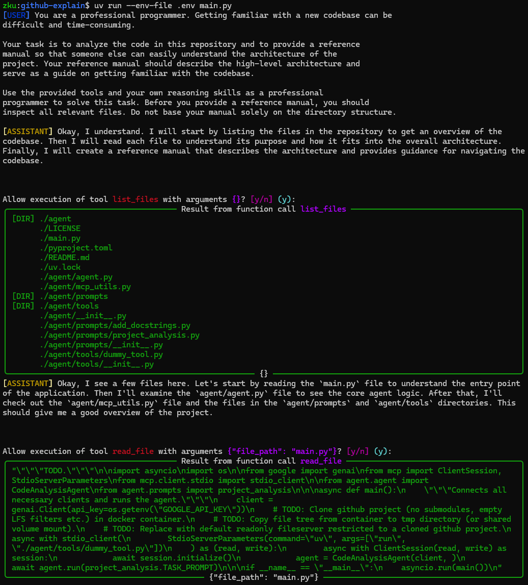

Implements AI agents to analyze codebases using Google's Gemini models with tool-calling support via MCP or in-process functions.



The following README contents are AI generated using the agent's `project_analysis` task.

## Reference Manual: Codebase Analysis Agent

This document provides a reference manual for understanding the architecture of the codebase analysis agent. It serves as a guide for developers who want to understand the project and contribute to its development.

### High-Level Architecture

The project aims to create an AI agent that can analyze a given codebase and generate a reference manual. The agent utilizes the Google Gemini API for reasoning and decision-making, and it employs a set of tools to gather information about the codebase. The architecture can be
broken down into the following components:

1.  **Main Entry Point (`main.py`):** This script parses command-line arguments (specifically the repository name), clones the specified repository using a Docker container, initializes the Gemini client and the MCP client, creates a `CodeAnalysisAgent`, and starts the agent's
execution.

2.  **Code Analysis Agent (`agent/agent.py`):** This class is the core of the application. It manages the interaction with the Gemini model and the execution of tools. The agent receives a task prompt, interacts with the Gemini model, processes the model's responses (including
text and function calls), and calls tools to gather more information. The agent maintains a history of interactions with the model and uses it to guide its analysis.

3.  **QA Agent (`agent/qa_agent.py`):** This module allows for interactive question answering about the codebase. It takes a `CodeAnalysisAgent` and an initial prompt, runs the agent with the prompt, and then prompts the user for questions. It feeds those questions to the agent
allowing it to explore the codebase based on user input.

4.  **Repository Cloning (`repo/clone.py`):** This module handles the cloning of the target repository. It uses Docker to create an isolated environment for the `git clone` command. The repository is cloned into a shared volume, making it accessible to the agent.

5.  **MCP (Message Context Protocol) Tools (`agent/tools/dummy_tool.py`):** This component provides tools for the agent to interact with the file system. It includes tools for listing files and reading file content. The MCP server restricts access to only the files within
the cloned repository, preventing the agent from accessing arbitrary files.

6.  **MCP Utilities (`agent/mcp_utils.py`):** This module contains utility functions for working with MCP clients and tools. It provides functions for converting MCP tool descriptions to Google Gemini function declarations, making it possible to seamlessly integrate MCP tools
with the Gemini model.

7.  **Prompts (`agent/prompts/project_analysis.py`):** This module defines the prompts used to guide the agent's behavior. The `TASK_PROMPT` variable contains the initial prompt that instructs the agent to analyze the codebase and generate a reference manual.

### Codebase Structure

The project's directory structure is organized as follows:

```
.
├── LICENSE
├── main.py
├── pyproject.toml
├── uv.lock
├── agent/
│   ├── __init__.py
│   ├── agent.py
│   ├── mcp_utils.py
│   ├── qa_agent.py
│   ├── prompts/
│   │   ├── __init__.py
│   │   ├── project_analysis.py
│   └── tools/
│       ├── __init__.py
│       ├── dummy_tool.py
├── repo/
│   ├── __init__.py
│   ├── clone.py
│   ├── Dockerfile
```

### Key Components and Their Interactions

The following diagram illustrates the interactions between the key components of the project:

```
+-----------------+      +---------------------+      +-----------------------+
|    main.py      |----->| CodeAnalysisAgent   |----->|   Google Gemini API   |
+-----------------+      | (agent/agent.py)    |      +-----------------------+
                       |                     |
                       |      +-------+      |
                       |----->| Tools |----->|
                       |      +-------+      |
                       |        (MCP)        |
                       +---------------------+
```

### Getting Familiar with the Codebase

To get started with the codebase, follow these steps:

1.  **Understand the `main.py` script:** This is the entry point of the application. It initializes the necessary components and starts the agent's execution.
2.  **Explore the `CodeAnalysisAgent` class:** This class is the core of the application. Understand how it interacts with the Gemini model and the available tools.
3.  **Examine the `repo/clone.py` module:** This module handles the cloning of the target repository. Understand how it uses Docker to create an isolated environment for the `git clone` command.
4.  **Investigate the MCP tools:** The `agent/tools/dummy_tool.py` module provides tools for interacting with the file system. Understand how these tools are used by the agent to gather information about the codebase.
5.  **Review the prompts:** The `agent/prompts/project_analysis.py` module defines the prompts that guide the agent's behavior.

This reference manual provides a comprehensive overview of the codebase analysis agent. By understanding the architecture and key components of the project, developers can effectively contribute to its development and improvement.
